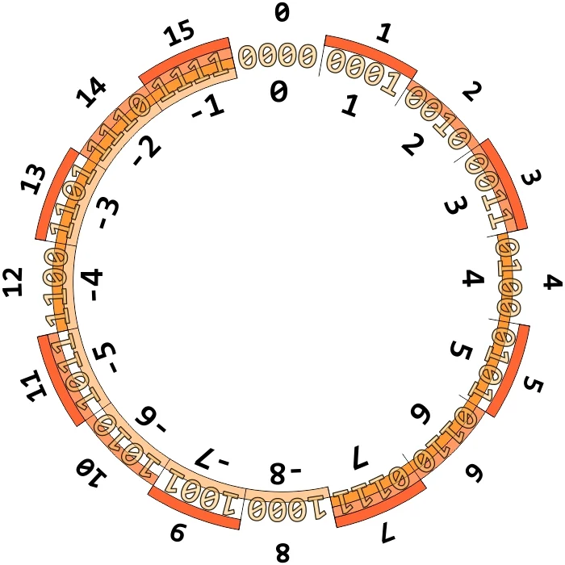

# Binary

Let's (re-)learn to count!

## Representing Numbers

To count the number of people in a room, we might start by using our fingers, one at a time. This system is called **unary**, where each digit represents a single value of one.

To count to higher numbers, we might use ten digits, 0 through 9, with a system called **decimal**. We use the decimal system every day!

Computers use another system called binary, with just two digits: 0 and 1.
For example, `000` in binary would be `000`, `1` in binary would be `001`, but `2` in binary would be `010`. Notice a pattern?

Each *binary digit* is also called a **bit**.

The pattern to count in binary with multiple bits is the same as the pattern in decimal with multiple digits.
For example, we know the following number in decimal represents one hundred and twenty-three: `123`
The `3` is in the ones place, the `2` is in the tens place, and the `1` is in the hundreds place.

Therefore $$ 1*10^2 + 2*10^1 + 3*10^0 = 1*100 + 2*10 + 3*1 = 123 $$

*Notice our bases are 10 because we are in the decimal system!*

In binary, we still use placeholders, except our base is 2:

For example, `111` in binary means $$ 1*2^2 + 1*2^1 + 1*2^0 = 4 + 2 + 1 = 7 $$ in decimal!

*Note*: to avoid confusion, if I am refering to a binary number I will write `0b111` or say "the binary number one-one-one". If I refer to a decimal number, I will write `111` and say "one hundred and eleven".

We can add leading zeros without changing the value of the number: `111 == 0111 == 00111` etc. We most often use numbers that have a width of 8 i.e. binary numbers with 8 binary digits. For example: `00000111`. A **byte** is just 8 bits.

## Converting Decimal to Binary

How would we write `255` in binary?

```math

2^8    2^7    2^6    2^5    2^4    2^3    2^2    2^1    2^0

?      ?      ?      ?      ?      ?      ?      ?      ?

```

$$ 2^8 = 256 $$ which is larger than 255, so $$ 2^8 $$ won't make a contribution to `255`. We'll take the next largest number `128` ($$ = 2^7 $$)

```math

2^8    2^7    2^6    2^5    2^4    2^3    2^2    2^1    2^0

0      1      ?      ?      ?      ?      ?      ?      ?

```
$$ 255 - 128 = 127 $$, so we need to now find the binary representation for `127`. We keep repeating this process until we have nothing left to convert. (This is a type of *[greedy algorithm](https://en.wikipedia.org/wiki/Greedy_algorithm)*)

```math

2^8    2^7    2^6    2^5    2^4    2^3    2^2    2^1    2^0

0      1      1      1      1      1      1      1      1

```

We have discovered that `0b11111111` represents `255`!


## Binary Arithmetic

Binary arithmetic is oftentimes easier than decimal arithmetic because we are only dealing with 2 symbols!

### Addition

In decimal, to add `9 + 3` we would

```text
  1
  09
+ 03
------
  12
```

Notice how we "run out of symbols" after `9`, so we must carry a `1` to the next place.

In binary, to add `0b01 + 0b01` we would

```text
  1
  01
+ 01
------
  10
```

Notice how `1 + 1 = 2`, but we don't have a symbol for `2` in binary, so we must carry over the `1`. Luckily `0b01 + 0b01` is really `1 + 1` and `0b10` is really `2` so the math works out!

```text
  1
  11
+ 01
------
 100
```

What happened? We added the 1s place, and carried over a `1`. Then we added the 2s place, and had to carry over another `1`. (`3 + 1 = 4`)

Notice how we started with 2-bit numbers and ended up with a 3-bit number. This is totally fine if we are just talking about adding numbers together: we do `9 + 1 = 10` all the time. However, what happens if our computer only has the hardware to deal with 2-bit numbers? In this situation, it is physically impossible for the computer to represent that leading `1`. Therefore, the `1` gets chopped off and our number has **overflowed**. We are then left with `0b11 + 0b01 = 0b00`. Huh. That's weird. Computers have limitations, and one of their limitations is the *range of numbers they can manipulate*. In the case of our 2-bit computer, we'd only be able to deal with the numbers `0`, `1`, `2`, and `3`. Luckily, most computers you interact with are 64-bit, so there're plenty of numbers to go around!

<!-- ### Left Shifts

### Right Shifts -->

## Unsigned and Signed Numbers

You may have asked the question "We've seen addition, but what about subtraction?" In binary, it's easier to add by the negative than to subtract directly. For an example in decimal `10 - 1 = 10 + (-1)`.

So far, we've only been able to represent non-negative numbers i.e. 0 and positive numbers. How might you represent a negative number in binary? How do we represent negative numbers in decimal?



[Binary Reference Sheet]({{ "/assets/pdfs/binary.pdf" | relative_url }})
