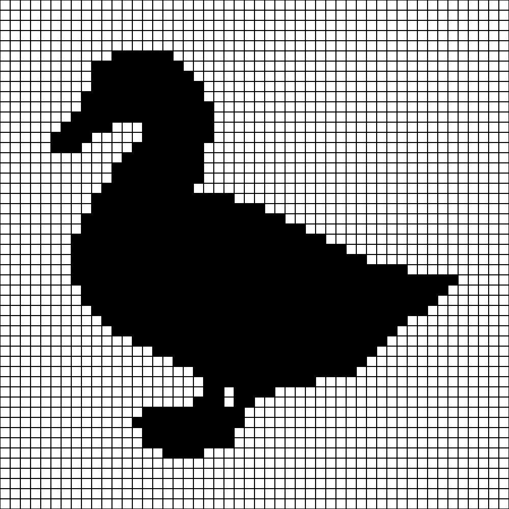
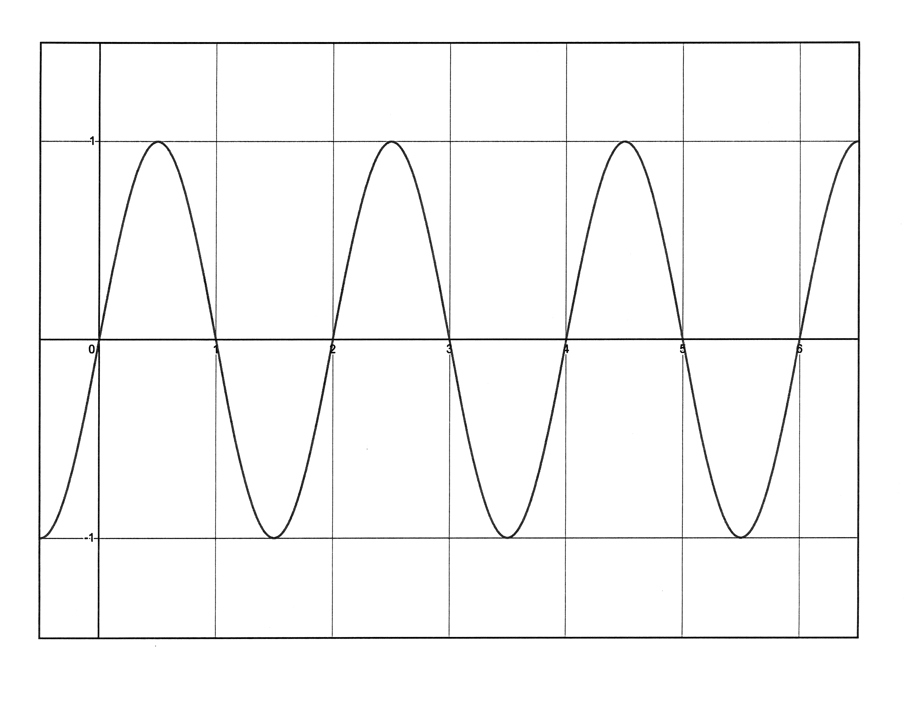
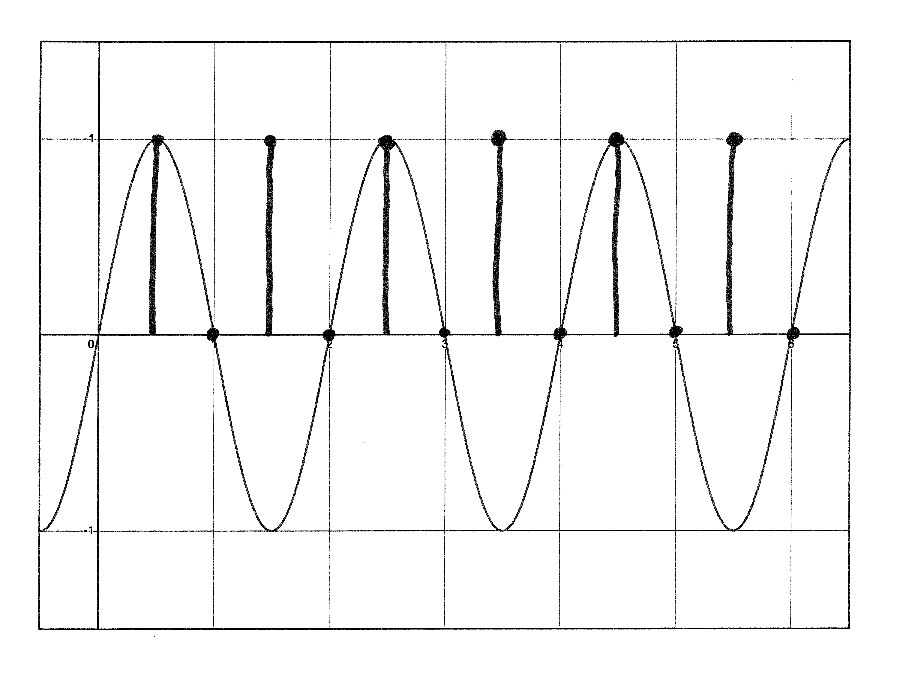
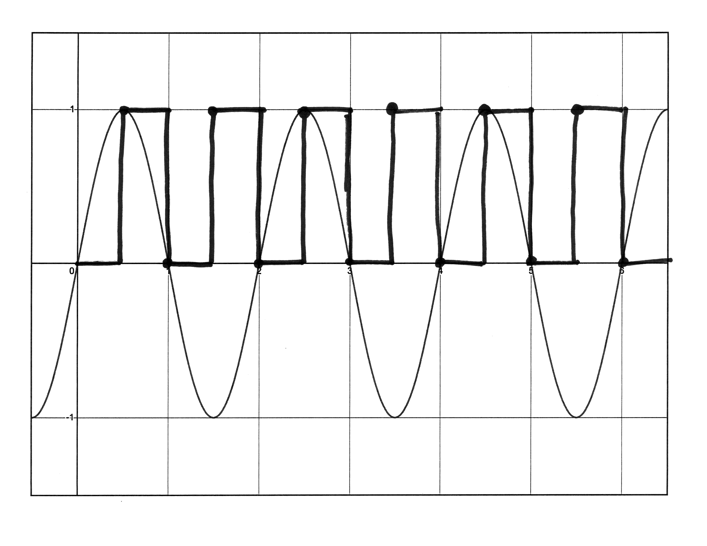
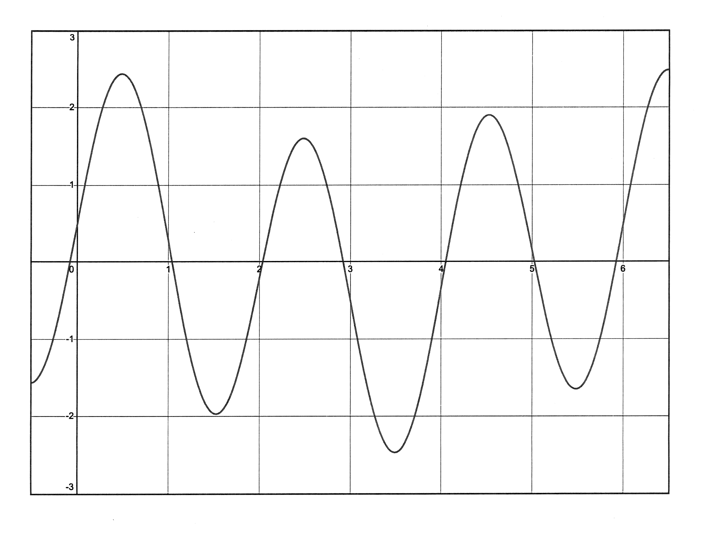
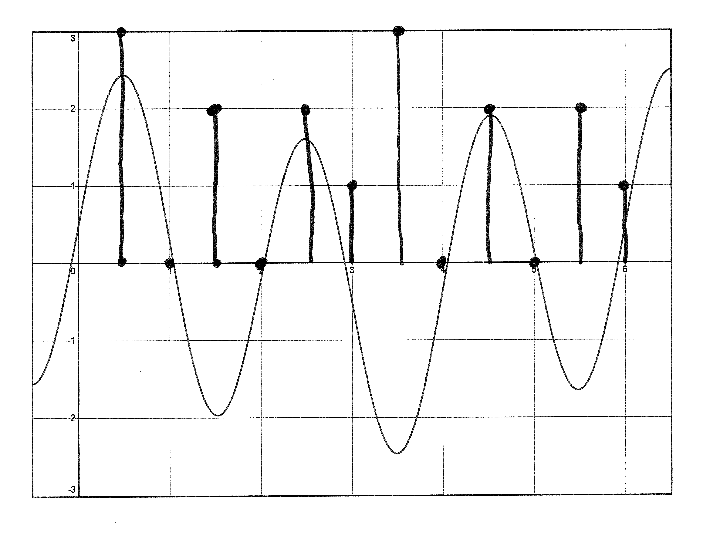
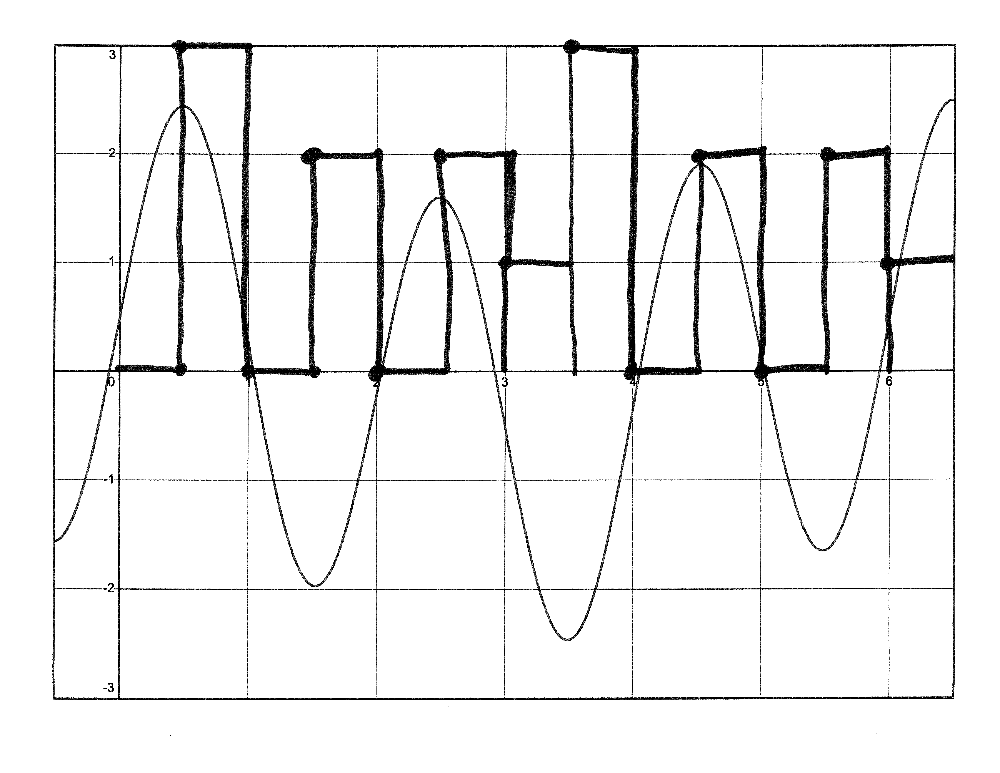

# Analog vs Digital Information

So far we've disccused **digital information**, information that is represented by `1`s and `0`s. However, in the real world, we come across data that is not represented by only 2 symbols. For example, we can talk about throwing a football 5.5 yards, 5.55 yards, 5.555 yards, etc. Temperature can exist as some fractional value with inifite precision (i.e. infinite number of digits after the decimal point). Thia **analog data**, or data that can exist on a spectrum, needs to be handled by the computer in order to solve problems that use real-world data points.

However, because computers are limited by the number of bits they can handle, anytime we convert an analog signal to a digital signal, we inevitably throw some information away. As we dedicate more and more bits to a digital representation, we get better approximations of the analog data, but can never fully and accurately an analog signal on a machine.

    

    

    

 

If we graph analog data across time, we get an analog signal:

## Converting from Analog to Digital

In order to convert an analog signal to a digital signal:

1. Choose a **sampling frequency**, or the number of times per second that we take a digital snapshot of the analog signal
    * the higher our sampling frequency, the more samples per second we take, and the closer to reality our digital signal becomes
    * sampling frequency is often measured in Hertz (Hz) -- samples per second -- and kHz (kilohertz) -- a thousand samples per second
        * so a sample frequency of 5kHz means the computer will take 5000 samples per second
    * this paramter is defined by the programmer or the digital file format, which we'll discuss below
2. The computer will start a clock and will take a snapshot at each interval
    * for a sampling frequency of 5 kHz, or 5000 samples per second, the computer will wait $\cfrac{1}{5000}$ seconds before taking a sample
3. The computer stores each sample in a new file that you can read

Let's "digitize" the analog signal from above. I'll choose to take a sample every half second (sample frequency is 2 Hz). For each sample, we must decide if the *amplitude* (distance from 0) of the data point is closer to `1` or `0`:

Notice that the computer only "sees" what occurs at each of the recorded samples. In between samples, it knows nothing and will assume that the previous reocrded sample is still valid:

So, to represent the digital signal as a binary sequence, the computer might store `0b0101010101010` to a file, where each bit is held for half a second. Again, the more sample you take, the more accurate your approximation will be. Notice that we use only one bit to store a sample: we must decide if the sample is closer to `1` or `0`. If our analog signal were a sound wave, for example, a `1` might represent "play at the loudest volume", while a `0` might represent "play nothing".

But what happens if we have a banger of a song, and want to hear all the nuances the song contains? We might want to dedicate more bits per sample. The **bit depth**, or the number of bits per sample, is also determined by the programmer or the file format.

Previously, we used a bit depth of 1. For the next analog signal, let's use a bit depth of 2 (we'll use the same sample frequency of 2 Hz):

For this example, we had four "volume" levels to choose from: `0`, `1`, `2`, and `3` -- represented by the 2-bit numbers `0b00`, `0b01`, `0b10`, `0b11`, respectively. However, sometimes our analog signal sat at, for example, a "volume" of 2.5. I decided that 2.5 was closer to `3` than it was to `2`, so I rounded up. This *rounding error* occurs because the computer does not have enough bits to represent every type of fractional value. In binary, this digital image would be `0b00 11 00 10 00 10 01 11 00 10 00 10 01`, where each sample is played for half a second.

To find the number of bits required to store one second of music, we simply multiply our sample frequency and bit depth:

$$\text{sample frequency} \cdot \text{bit depth} = \text{# of bits for one second}$$

## Audio Formats

There are many ways to store the digital signals we've seen. Each *audio format* interprets binary data as sound. Each audio format will also save information about the recording, such as the sampling frequency and the bit depth.

MIDI (Music Instrument Digital Interface) describes sound in terms of pitch and duration. This sound doesn't have to be a recording. The computer can syntheize sound using its "vocal cords" (speakers) and produce a tinny, robotic piece of music. The MIDI format can also handle recorded music.

Other file types for recorded music are MP3 and WAV. WAV is an uncompressed file format and generally produces higher quality recordings that MP3, which is a compressed file format. This indicates that MP3 uses a lossy compression!

## Image Formats

Analog signals don't just come in the form of sound. Light is a type of analog signal. This means that images are a multi-dimensional analog signal -- one dimension is the height and width, the other is the image's color.

GIF (Graphics Interchange Format) is a lower quality, 8-bit per pixel image format that can be animated:

JPEG is a 24-bit "truecolor" image format that uses lossy compression, while PNG uses 24-bits as well as lossless compression.

## Metadata

Every file format, regardless if audio, visual, or otherise, contains **metadata**. Metadata is data about data.
An audio file format will store the raw binary as well as information about the bit depth and sampling frequency. An image file format will store the raw binary data as well information about:

* when the image was created
* when the image was last modified
* when the picture was taken
* where the picture was taken
* the size of the image
* the type of color scheme used
    * black and white, or color

Metadata is useful if we want to organize files by creation date, or if we wanted to extract files that contain the letter "A" in their file names, etc.
