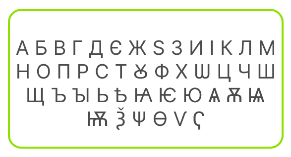

# Text Data

## ASCII

Apart from numbers, we use many different types of data. If we are writing an essay in Microsoft Word or Google Docs, our data is in the form of *text*, or alphabetical letters.

Here's the problem: if computers only understand binary, how can we represent text?

We solve this problem by mapping letters (or **characters**) to numbers. Here, humans are interpreting letters as numbers, and vice versa -- the computer doesn't care about letters; in fact, letters don't really exist for a computer. Computers will only see the binary mapping of the letter.

An obvious mapping is to say `A` &rarr; `0`, `B` &rarr; `1`, `C` &rarr; `2`, and so on.

Instead of this trivial mapping, however, we often use American Standard Code for Information Interchange, or **ASCII**. ASCII dedicates 7 bits to represent one character (the extended ASCII dedicates 8 bits, for more characters). Characters include uppercase letters, lowercase letters, punctuation, and special functions.

As we can see below, the 7-bit ASCII allows for 128 different characters:

So when we hit the Tab key, the computer really sees the number `0b0001001`, or `9`. When we hit the `A` key, the computer really sees `0b1000001`.

Therefore, the binary sequence `0b10010001101001` can be interpreseted as the message "Hi" (`H` &rarr; `0b1001000`; `i` &rarr; `0b1101001`).

ASCII is a great system and widely used; however, it maps numbers to only characters from the Latin alphabet. What are all the people writing in Cyrillic or Arabic scripts supposed to do?

## Unicode

Unicode is another way to map numbers to character. While ASCII dedicates at most a byte for each character, Unicode sets aside **32 bits**, or 4 bytes, for one character. That means Unicode can represent 4294967296 characters total -- remember, ASCII can only represent 128 characters.

Unicode can represent characters from a variety of alphabets as well as emojis.

### Emojis

To represent emojis, Unicode maps *descriptions* to numbers. For example, the description "face with medical mask" is mapped to `0b11110000100111111001100010110111`. Whenever you text your friend an emoji, what you're actually sending is the string of bits. Your friend's phone receives this binary number, looks up the description "face with medical mask", and then displays the image associated with that description:

## **Key Takeaway**

Computers do not interpret data; they just consume binary numbers. Humans interpret binary as either decimal numbers or text. The value of the data does not have to change, but its representation can change wildly, depending on context.

For example, `0b10010001101001` can be interpreted as *either* "Hi" or `9321`, depending if we are in Microsoft Word or the Calculator App.

## Extra Resources

* <a href="https://docs.google.com/viewer?url=https://github.com/APCSP-SLCA/slides/raw/main/ascii/slides.pdf" target="_blank">Slides</a>
