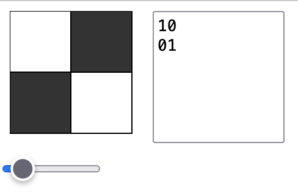

# Instructions  

Welcome to the pixel lab!

  ## Steps
  1. Press the **&#9658;Run** button
  2. You may open the lab in a new tab
  3. Use the slider to increase the size of the image
  4. Type in the text box some binary to turn the pixels "on" (white) or "off" (black)

  For example, the binary
`10
01`
produces the following image

  
  
  