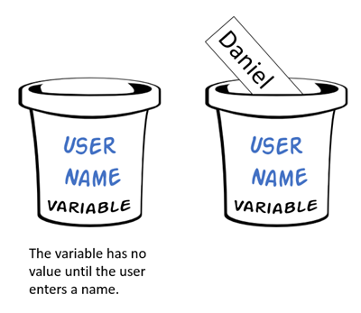

# Variables and Data Types

In math, `=` indicates *equality*. `x = y` means that `x` is forever equal to `y`, and whatever we do to one side of the equal sign we do to the other.

In programming, `=` does NOT indicate equality. Rather, it indicates *assignment*. We *assign* a variable some value, and later on we can *assign* that variable a different value.

Look at the illustration below:



Initially, we haven't assigned the `username` variable a specific value; in Python, we might say `username = None`.  Later, we assign "Daniel" to `username`. Even later, we might assign "Rachel" to `username`. Variables are storage containers that hold values.

So what types of data can variables hold? Basic **data types** include integers, floats, Booleans, and strings.

Integers are whole numbers: `..., -2, -1, 0, 1, 2, ...`, while floats are decimal numbers, e.g. `0.5, -0.75, 3.14159265359`.

There are two values for Booleans: `True` and `False`. Booleans let us use conditionals and check if something is true. In many programming languages, `True` maps to `1` and `False` maps to `0`.

Lastly, strings are really "characters that are strung together". 'Rachel', "Happy Birthday", """Hello, World!""" are all strings. Notice that strings can be surrounded by single, double, or triple quotes (in practice, triple quotes are less common).


In many programming languages like C, you must declare the type.

```c

int main(void) {
    int x = 10;

    printf("%i\n", x);
}

```

In the C program above, `x` is declared as an integer, and so the program will not work properly if later we say `x = 0.5`. Python is *dynamically typed*, so you don't actually need to declare types for each variable:

```python

def main():
    x = 10

    print(f"{x}")

    x = "x is not an integer anymore"

    print(f"{x}")

```

You do, however need to make sure you aren't making *logical errors*. For example, if you are expecting that your variable contains a string, your program probably shouldn't be storing floats in that variable.

```python

def main():

    print("My name is ")

    x = "Joshua"
    x = 0.5

    # this is a logical error
    # you expected x to contain "Joshua"
    # but then your program set x to 0.5
    print(f"{x}")

```

## Operators

Now that we've talked about variables, let's talk about basic ways to manipulate variables.

| **Operator** | **Description**     | **Example**    |
|--------------|---------------------|----------------|
| +            | addition            | `x + y`        |
| -            | subtraction         | `x - y`        |
| *            | multiplication      | `x * y`        |
| **           | power               | `2**3 = 8`     |
| /            | division            | `9 / 2 = 4.5`  |
| //           | integer division    | `9 // 2 = 4`   |
| %            | modulo (remainder)  | `9 % 4 = 1`    |

*Note: `%` divides the first number by the second number and returns the remainder*
