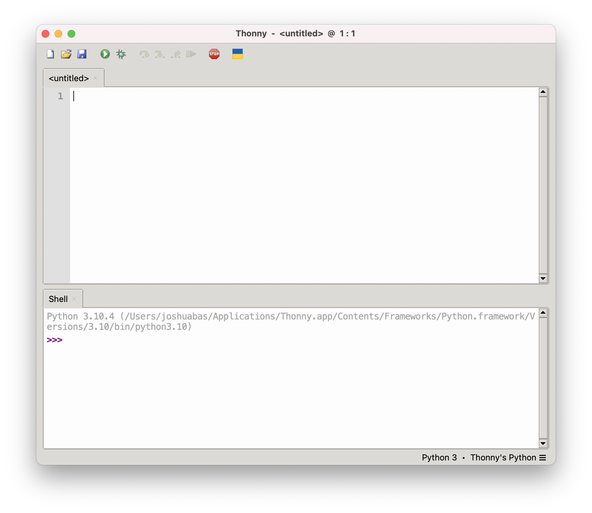
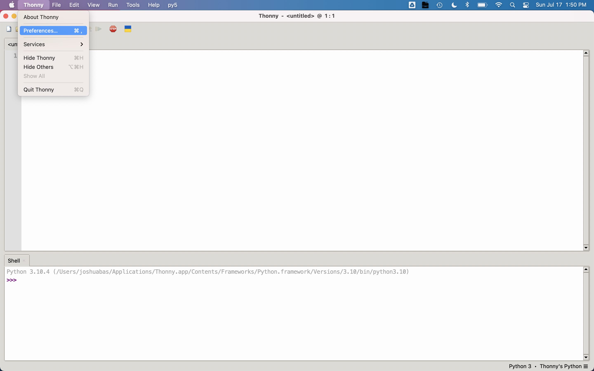

# Getting Started

Lovely walkthrough on installing Python and Pyzo!

## Python

We will be learning the Python programming language. Python is human-readable and used to teach programming in highschool and college-level courses. Apple computers have Python installed by default to run backwards-compatible maintenance programs; however, this version of Python is old, so we will need to install a newer version ourselves.

## Python Installation

Go to the [python downloads page](https://www.python.org/downloads/). Click "Download Python 3.x" (make sure that the "x" is a number greater than 7, i.e. 3.8, 3.9, or 3.10)

Once downloaded, double click the .pkg file, and move the expanded "Python 3.x" file to your Applications folder.

## Pyzo

We will be using the Pyzo IDE (**i**ntegrated **d**evelopment **e**nvironement) for this course. For each programming assingment you will download the associated zip file and unzip by double clicking. You will then have access to instructions and any code I provide. You will also have access to a `submit.py` program that zips your files back up so that you can upload your work to Google Classroom.

## Pyzo Installation

To install Pyzo on your Mac, click [pyzo-4.12.3-macos_x86_64.dmg](https://github.com/pyzo/pyzo/releases/download/v4.12.3/pyzo-4.12.3-macos_x86_64.dmg){:target="_blank"} to download the package.

Right-click-open the downloaded file. The package installer walks you through installing Pyzo.

After Pyzo is set up, we need to install some Python packages that we'll be using throughout the semester. Python packages will allow us to create animations and use other people's code without re-inventing the wheel multiple times over. *This is a form of collaboration!*

Download, unzip, and open [`setup.py.zip`](https://github.com/APCSP-SouthLakeChristian-Academy/programming/raw/main/setup.py.zip) in Pyzo.

In Pyzo, click `Run > Run file as script` or press `Shift-Command-E`. If everything went well, the program should list out all the installed packages.

<!-- 

---

### Important

You **must** select `Install for me only`. If you didnt see that option, click the `Go Back` button.

---

You can then go to your `Applications` and open Thonny.

## Install Py5 Plugin

Later in the year we'll be programming some graphical applications; let's install those dependencies now.

We'll be using the [Processing](https://processing.org/) framework that has been ported over to Python via [py5](https://py5.ixora.io/index.html).

Click `Imported mode for py5` whenever you want to draw shapes!

## Optional Themes

You can adjust the style of the Thonny editor using themes.

I like the `Clean Dark` UI Theme and `Tomorrow Night` Syntax Theme so that my eyes aren't burned off while programming at night. (You shouldn't need to spend extraordinary amounts of time programming for this course, though.)

I aso like to set `IO font` to `14`. -->
