# Thonny

We will be using the Thonny IDE (**i**ntegrated **d**evelopment **e**nvironement) for this course. For each programming assingment you will download the associated zip file and unzip by double clicking. You will then have access to instructions and any code I provide. You will also have access to a `submit.py` program that zips your files back up so that you can upload your work to Google Classroom.

## Installation

To install Thonny on your Mac, click [thonny-4.0.0b3.pkg](https://github.com/thonny/thonny/releases/download/v4.0.0b3/thonny-4.0.0b3.pkg){:target="_blank"} to download the package.

After double clicking the downloaded file, the package installer walks you through installing Thonny.

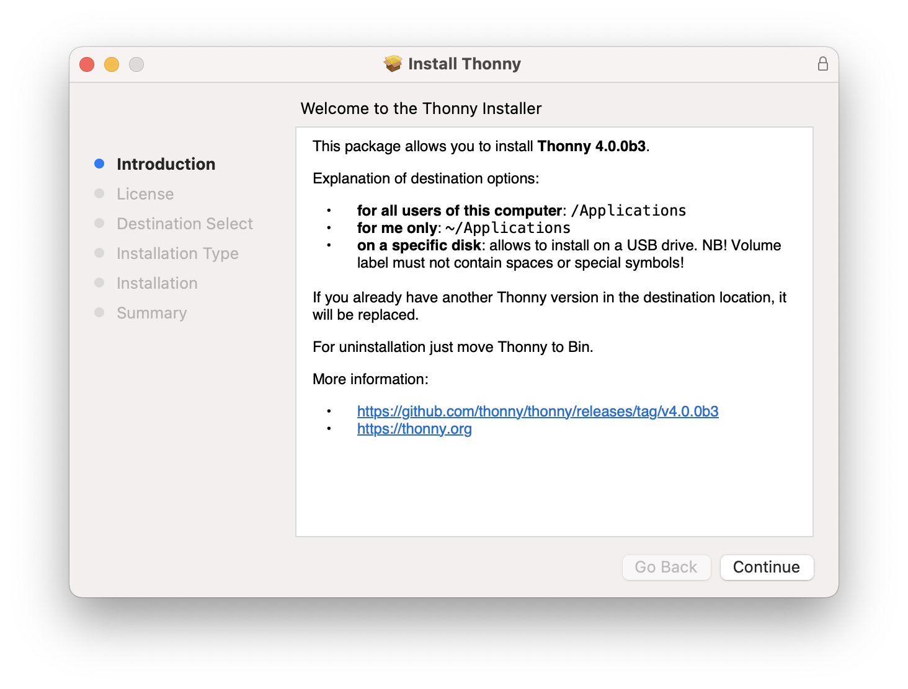
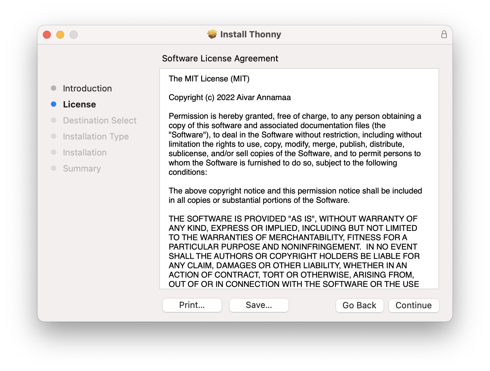
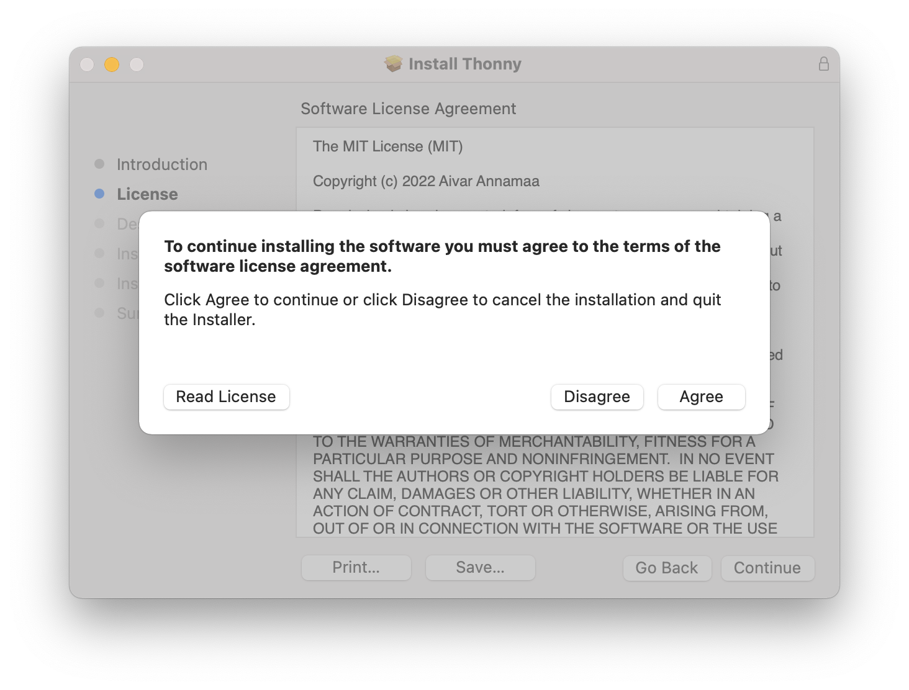
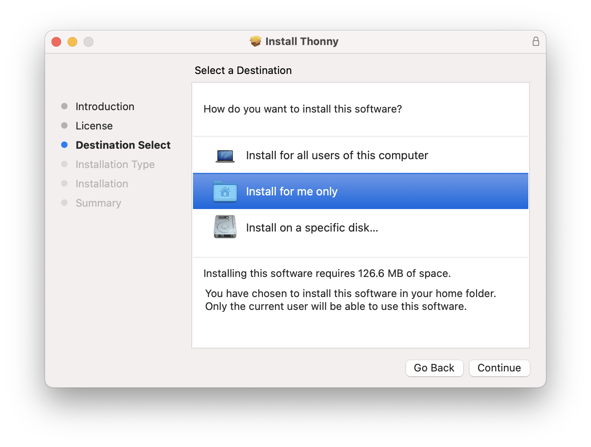

---

### Important

You **must** select `Install for me only`. If you didnt see that option, click the `Go Back` button.

---

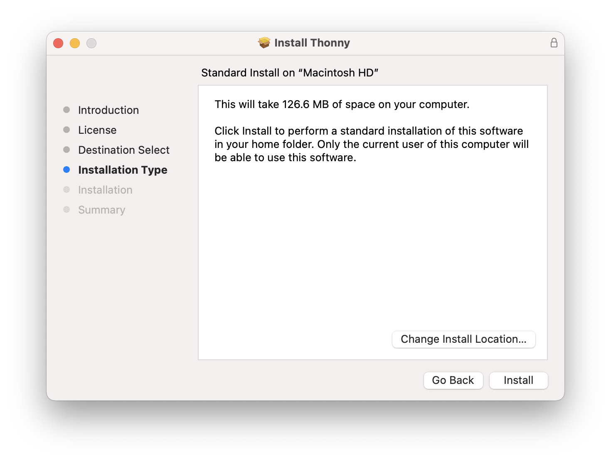

You can then go to your `Applications` and open Thonny.

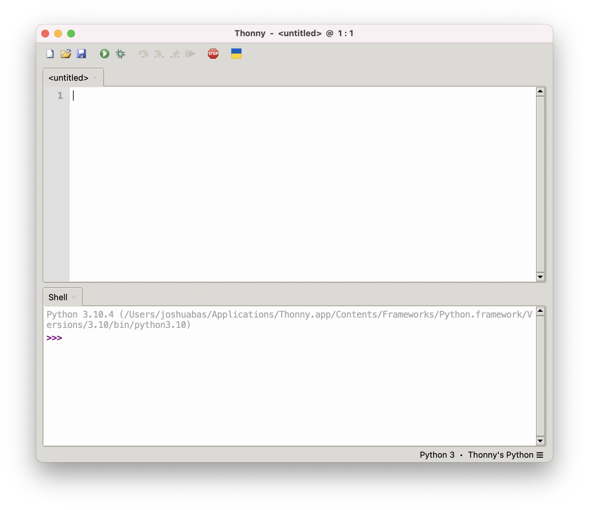

## Install Py5 Plugin

Later in the year we'll be programming some graphical applications; let's install those dependencies now.

We'll be using the [Processing](https://processing.org/) framework that has been ported over to Python via [py5](https://py5.ixora.io/index.html).

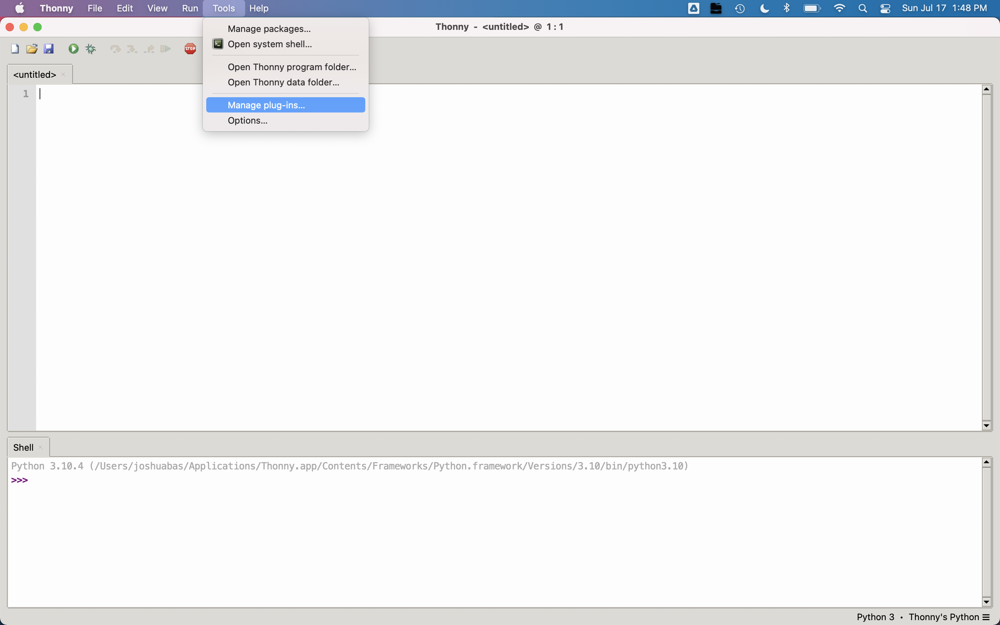

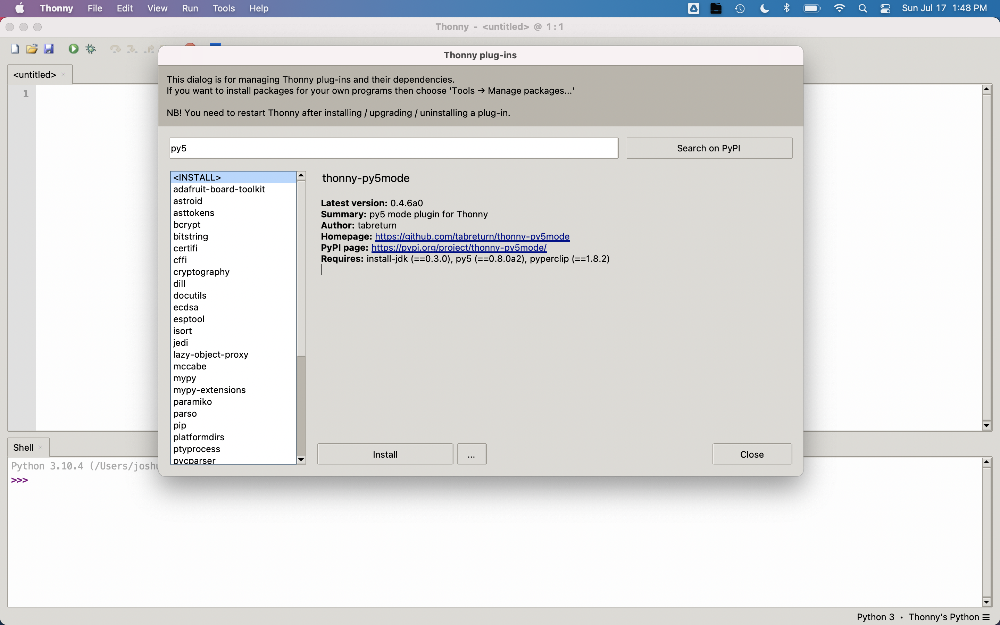

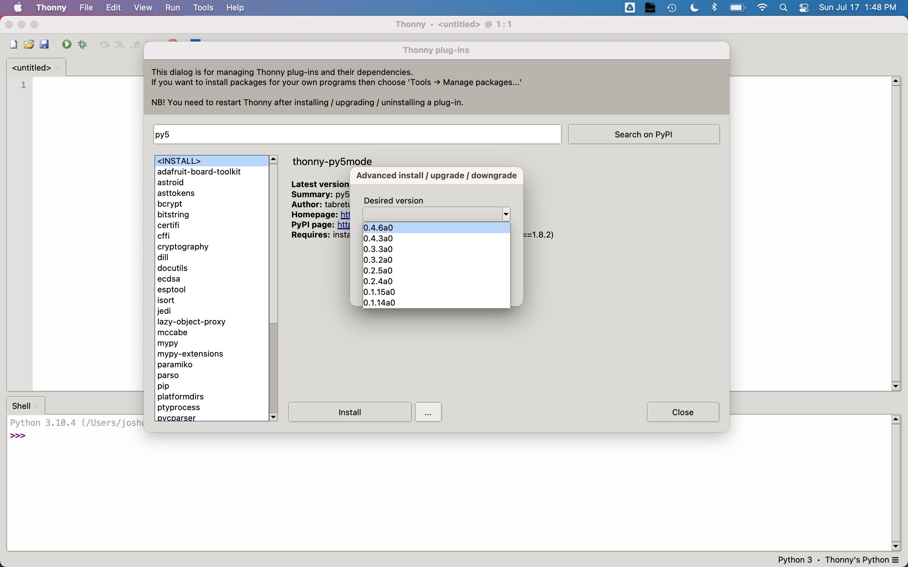

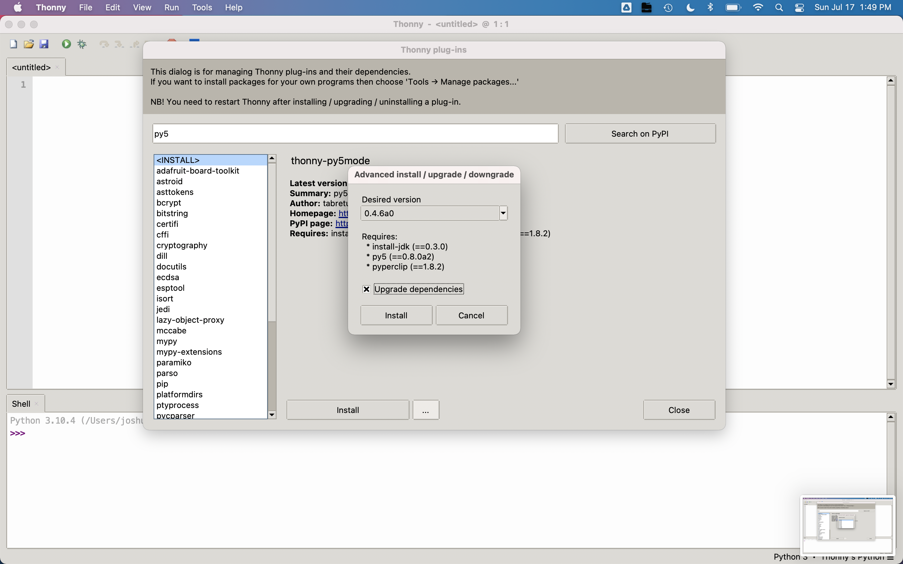

Click `Imported mode for py5` whenever you want to draw shapes!

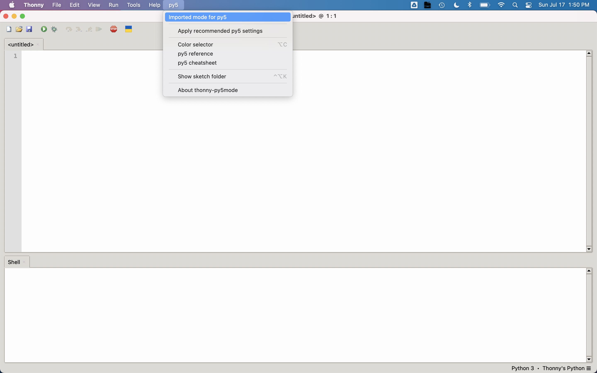

## Optional Themes

You can adjust the style of the Thonny editor using themes.

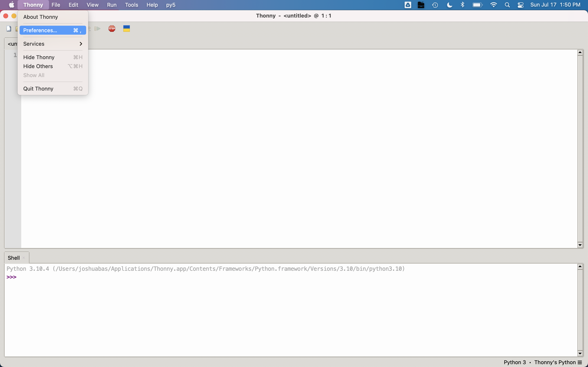

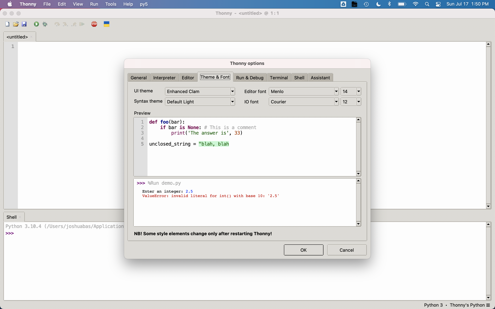

I like the `Clean Dark` UI Theme and `Tomorrow Night` Syntax Theme so that my eyes aren't burned off while programming at night. (You shouldn't need to spend extraordinary amounts of time programming for this course, though.)

I aso like to set `IO font` to `14`.
